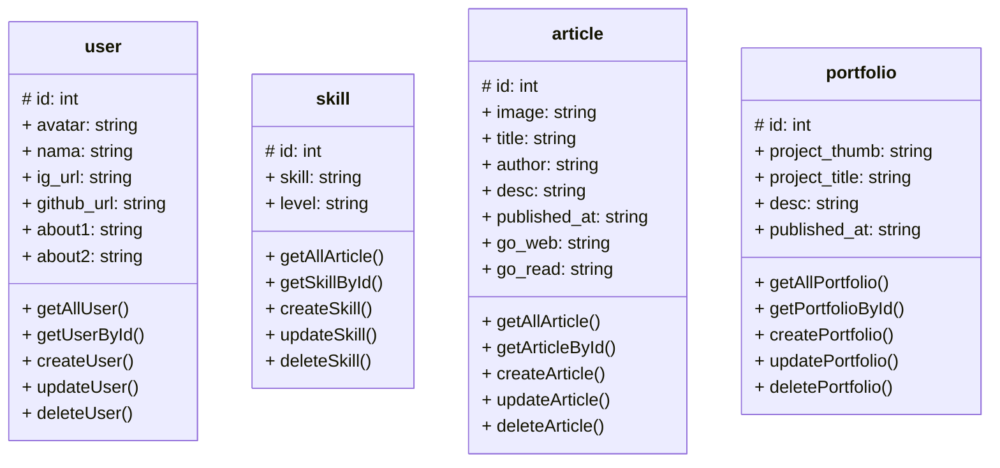

## API Points

Beberapa entitas yang diperlukan dalam pengembangan aplikasi diantaranya adalah users, portfolios, dan articles.

### Authentication

> ### Users

#### Menampilkan data semua pengguna

```
GET: /users

response:
[
    {
        "id"            : "",
        "avatar"        : "",
        "nama"          : "",
        "ig_url"        : "",
        "github_url"    : "",
        "about1"        : "",
        "about2"        : ""
    },
    ...
]
```

#### Menampilkan data pengguna dengan `id` tertentu

```
GET: /users/[id]

reponse:
{
    "id"            : "",
    "avatar"        : "",
    "nama"          : "",
    "ig_url"        : "",
    "github_url"    : "",
    "about1"        : "",
    "about2"        : ""
}
```

#### Menambahkan data pengguna

```
POST: /users

headers:
{
    Content-type: 'application/json',
    Authorization: 'Bearer [access_token]'
}

body:
{
    "id"            : "",
    "avatar"        : "",
    "nama"          : "",
    "ig_url"        : "",
    "github_url"    : "",
    "about1"        : "",
    "about2"        : ""
}

response:
true    // if success
false   // if failure
```

#### Edit data pengguna

```
PUT: /users

headers:
{
    Content-type: 'application/json',
    Authorization: 'Bearer [access_token]'
}

body:
{
    "id"            : "",
    "avatar"        : "",
    "nama"          : "",
    "ig_url"        : "",
    "github_url"    : "",
    "about1"        : "",
    "about2"        : ""
}

response:
true    // if success
false   // if failure

```

#### Menghapus data pengguna

```
DELETE: /users/[id]

headers:
{
    Content-type: 'application/json',
    Authorization: 'Bearer [access_token]'
}

response:
true    // if success
false   // if failure
```

> ### Skills

#### Menampilkan data semua skill

```
GET: /skill

response:
[
    {
        "id"        : "",
        "skill"     : "",
        "level"     : ""
    }
    ...
]
```

#### Menampilkan data berdasarkan `id` tertentu

```
GET: /skill/[id]

response:
{
    "id"        : "",
    "skill"     : "",
    "level"     : ""
}
```

#### Menambahkan data skill

```
POST: /skill

headers:
{
    Content-type: 'application/json',
    Authorization: 'Bearer [access_token]'
}

body:
{
    "skill"     : "",
    "level"     : ""
}

response:
true    // if success
false   // if failure
```
#### Mengubah data skill

```
PUT: /skill

headers:
{
    Content-type: 'application/json',
    Authorization: 'Bearer [access_token]'
}

body:
{
    "id"        : "",
    "skill"     : "",
    "level"     : ""
}

response:
true    // if success
false   // if failure
```

#### Menghapus data skill

```
DELETE: /skill/[id]

headers:
{
    Content-type: 'application/json',
    Authorization: 'Bearer [access_token]'
}

response:
true    // if success
false   // if failure
```

> ### Articles

#### Menampilkan semua data article

```
GET: /article

response:
[
    {
        "id"                : "",
        "image"             : "",
        "title"             : "",
        "author"            : "",
        "desc"              : "",
        "published_at"      : "",
        "go_web"            : "",
        "go_read"           : ""
    }
    ...
]
```
#### Menampilkan data article berdasarkan `id` tertentu

```
GET: /article/[id]

response:
{
    "id"                : "",
    "image"             : "",
    "title"             : "",
    "author"            : "",
    "desc"              : "",
    "published_at"      : "",
    "go_web"            : "",
    "go_read"           : ""
}
```
#### Menambahkan data article

```
POST: /article

headers:
{
    Content-type: 'application/json',
    Authorization: 'Bearer [access_token]'
}

body:
{
    "image"             : "",
    "title"             : "",
    "author"            : "",
    "desc"              : "",
    "published_at"      : "",
    "go_web"            : "",
    "go_read"           : ""
}

response:
true    // if success
false   // if failure
```
#### Mengubah data article

```
PUT: /article

headers:
{
    Content-type: 'application/json',
    Authorization: 'Bearer [access_token]'
}

body:
{
    "id"                : "",
    "image"             : "",
    "title"             : "",
    "author"            : "",
    "desc"              : "",
    "published_at"      : "",
    "go_web"            : "",
    "go_read"           : ""
}

response:
true    // if success
false   // if failure
```
#### Menghapus data article

```
DELETE: /article/[id]

headers:
{
    Content-type: 'application/json',
    Authorization: 'Bearer [access_token]'
}

response:
true    // if success
false   // if failure
```
> ### Portfolios

#### Menampilkan semua data Portfolio

```
GET: /portfolio

response:
[
    {
        "id"                : "",
        "project_thumb"     : "",
        "project_title"     : "",
        "desc"              : "",
        "published_at"      : ""
    }
    ...
]
```
#### Menampilkan data portfolio berdasarkan `id` tertentu

```
GET: /portfolio/[id]

response:
{
    "id"                : "",
    "project_thumb"     : "",
    "project_title"     : "",
    "desc"              : "",
    "published_at"      : ""
}
```

#### Menambahkan data portfolio

```
POST: /portfolio

headers:
{
    Content-type: 'application/json',
    Authorization: 'Bearer [access_token]'
}

body:
{
    "project_thumb"     : "",
    "project_title"     : "",
    "desc"              : "",
    "published_at"      : ""
}

response:
true    // if success
false   // if failure
```
#### Mengubah data portfolio

```
PUT: /portfolio

headers:
{
    Content-type: 'application/json',
    Authorization: 'Bearer [access_token]'
}

body:
{
    "id"                : "",
    "project_thumb"     : "",
    "project_title"     : "",
    "desc"              : "",
    "published_at"      : ""
}

response:
true    // if success
false   // if failure
```
#### Menghapus data portfolio

```
DELETE: /portfolio/[id]

headers:
{
    Content-type: 'application/json',
    Authorization: 'Bearer [access_token]'
}

response:
true    // if success
false   // if failure
```
> ### Design Database


